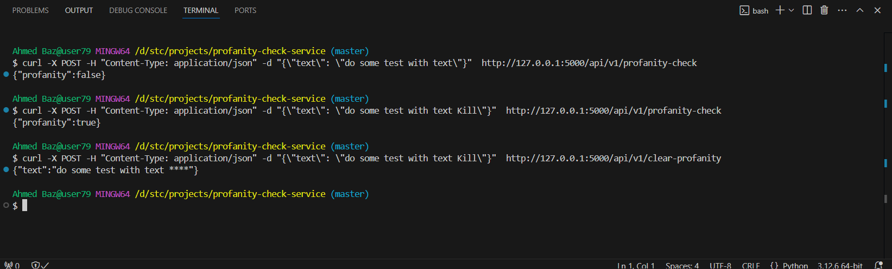

# profanity check service

* a python service to check profanity
* provided API to check profanity and responded with true or false
* provided API to clear any profanity and responded new clear text

  

## Used Technology:

* python library `better_profanity`
* Flask for preparing APIs
